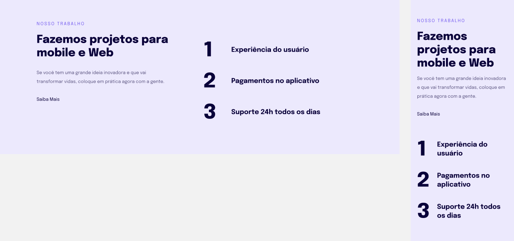

<h1 align="center"> Explorer - Projeto 04 - Introduçao à responsividade</h1>

&nbsp;&nbsp;&nbsp;

 
 

  

---

# 💻 Projeto 

## 🧪 Tecnologias | HTML e CSS

##  📕 Sobre

Projeto desenvolvido em treinamento em introdução a responsividade , juntamente com a 
<a  href="https://www.rocketseat.com.br">Rocketseat</a> 🚀,
no decorrer do programa <b>Explorer</b>.

### Informações  

📅 **07.02.2023**

🕛 **Status:** Concluído✔️

☑️ **Task:** Construir um site estático a partir do projeto feito no [Figma](https://www.figma.com/files/recents-and-sharing/recently-viewed?fuid=1271434356960375995). 
Projeto disponível neste [Link](https://www.figma.com/file/PLAIZvrQfVpMdpXesNPCiu/Explorer-Stage-03-Projeto-02-(Copy)?type=design&node-id=203-412&mode=design&t=Ah7Nphg4nBcpYqul-0).

Developed by Jeferson 🚀

  

